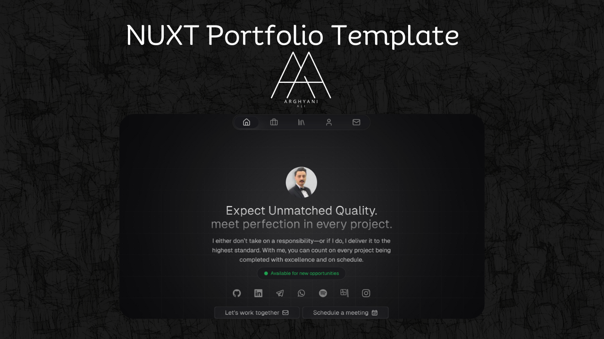

# Canvas template

This is a fully customizable portfolio template built with [Nuxt.js](https://nuxtjs.org/) and [Tailwind CSS](https://tailwindcss.com/). Use it to showcase your work, testimonials and other information to your clients.

## Demo

You can see a live demo at [canvas.hrcd.fr](https://aliarghyani.vercel.app/).


## Features

- Fully [Nuxt Content](https://content.nuxt.com/) driven with the content driven mode on
- Full and simple [Nuxt Studio](https://nuxt.studio/) editor support
- Built-in Awesome Component & Layout
- [NuxtUI](https://ui.nuxt.com/) for some UI components
- [Tailwind CSS](https://tailwindcss.com/)
- Working contact form with [Resend](https://resend.com/)
- [Nuxt i18n](https://i18n.nuxtjs.org/) for multi-language support
- Open Graph Image support with [Nuxt OG Image](https://nuxtseo.com/og-image/getting-started/installation)
- [Nuxt Robots](https://sitemap.nuxt.com/) for auto-generate robots.txt
- [ESLint](https://eslint.org/) with official Nuxt configuration (ESLint v9 with Flat config)
- Full typescript support
- Optimized images with [Nuxt Image](https://image.nuxt.com/)
- [Vue Composition Collection (Vueuse)](https://vueuse.org/)
- Fully responsive on all modern browsers
- Professional and minimal design
- Easy to customize
- Auto generated sitemap

## Quick Setup

1. Clone this repository if you have access or download it from the store
```bash
git clone git@github.com:Norman5353/nuxt-portfolio-ali.git
```

2. Install dependencies
```bash
bun install
```

3. Copy the `.env.example` file to `.env` and fill in the values
```bash
cp .env.exemple .env
```

4. Start development server
```bash
bun dev
```

5. Generate static project
```bash
bun generate
```

6. Start production server
```bash
bun start
```

## How to Modify the Portfolio Content

This portfolio uses [Nuxt Content](https://content.nuxt.com/) to manage the content. Here's how you can modify it:

First check the `app.config.ts` file to change the global configuration of the portfolio, there is a lot of stuff you can change here.

### Writing

1. Navigate to the `content/2.articles` directory.
2. Here, you'll find Markdown files for each article. To modify an article, simply open its Markdown file and make your changes.
3. To add a new article, create a new Markdown file in this directory. The name of the file will be used as the URL slug for the article.

### Works

1. Navigate to the `content/1.works/` directory.
2. Here, you'll find Markdown files for each article. To modify an article, simply open its Markdown file and make your changes.
3. To add a new project, add a new JSON file in this directory.

#### Featured Works

To change the featured works on the homepage, simply add the `featured: true` key to front matter of the markdown file.

### Other Content

Simply go to the `content/` directory and edit any of the Markdown or JSON files to modify the content.

## Setup the Contact Form

This portfolio uses [Resend](https://resend.com/) to handle the contact form. To set it up, follow these steps:
- Get your api key from [Resend](https://resend.com/) here [your api key](https://resend.com/api-keys)
- Add your api key in the `.env` file
- change the `from` key in the `sendEmail` route in the `server/api/` folder, you can customize everything you want in this route
- That's it, you're good to go!

## Setup the Open Graph Image

To change the main open graph image, go to the `app.config.ts` file and change the `openGrapImage` key.
For the blog open graph image, go to the `content/articles` directory and change the `image` key in the Markdown file of the article.


---

_🤖 auto updated with [automd](https://automd.unjs.io) (last updated: Sun Aug 25 2024)_

<!-- /automd -->
